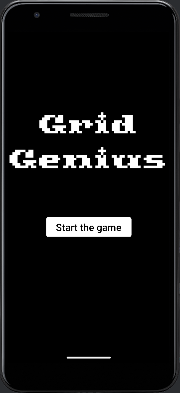
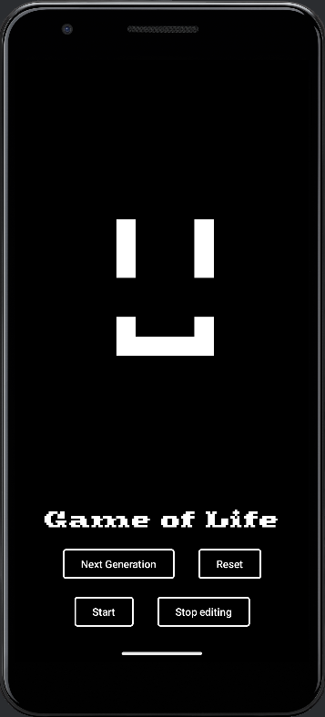

# Grid Genius

Grid Genius is an Android application that simulates and explores Conway's Game of Life, a fascinating cellular automaton where complex patterns emerge from simple rules.

## Key Features

- **Game of Life Simulation:** Explore Conway's Game of Life with custom configurations.
- **Interactive Interface:** Use touch controls to interact with the grid.
- **Time Control:** Pause, accelerate, or slow down the simulation to observe patterns in detail.
- **Customization:** Create your own cell configurations to see how they evolve.

## Screenshots

*Title menu*

*Main game*

## Getting Started

To run the Grid Genius app locally, follow these steps:

1. Clone this repository to your local machine.
2. Open the project in Android Studio.
3. Build and run the project on an Android emulator or physical device.

## Usage

- Launch the app and explore the initial configuration of cells.
- Use touch controls to interact with the grid: tap to toggle cell states.
- Control the simulation speed to observe how patterns evolve over time.

## Contributing

We welcome contributions to improve Grid Genius! If you have ideas for new features, bug fixes, or enhancements, please open an issue or submit a pull request.
